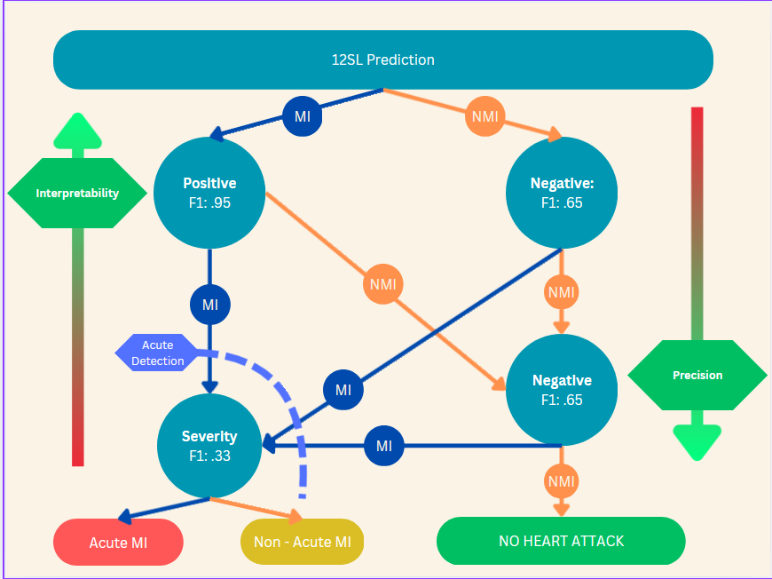

# Stroke of Luck 
[Repository Link](https://github.com/clv07/stroke-of-luck)

## Project Overview
12SL is the algorithm used by GE Healthcare Physicians in determining Myocardial Infarction (MI), or heart attack in a more common term from patients' electrocardiogram (ECG). We trained a machine learning model to improve 12SL misclassification by identifying both false positives (missed MI detection) and false negatives (incorrect MI detection). We also further classify MI cases as either acute or non-acute. This enables better evaluation of MI in borderline cases and helps physicians make quicker and more accurate clinical decisions, especially in emergency situations.

## Installation and Setup
1. Clone the repository.
```
git clone https://github.com/clv07/stroke-of-luck.git
```
2. Setup and activate a virtual environment.
```
python3 -m venv venv
```
3. Install required libraries. 
```
pip install -r requirements.txt
```
4. Run the script.
```
python3 mi_detection.py
```

## Code Structure

### Data Preprocessing
We first read in the ECG data provided by our mentors along with header files from the [Physionet Challenge](https://moody-challenge.physionet.org/2021/). The data preprocessing step involves merging multiple tables into a single consolidated file, standardizing column names, handling missing values, and then splitting the dataset into false positive and false negative groups for separate model training.

### Model Overview
Our model is designed as a two-pass ensemble system using three different Light Gradient Boosting Machine (LightGBM) trained upon thousands of ECG records.

In the first pass, two LightGBM classifiers were trained on false positives and false negatives from the 12SL algorithm to classify cases as MI or non-MI (NMI). Records predicted as NMI are re-evaluated using the false negative model to reduce the risk of missing true MIs. These three models work together to correct 12SL misclassifications and improve initial categorization.

In the second pass, a third LightGBM model further classifies MI cases as acute or non-acute, enabling more precise identification of urgent conditions.



### Example Report Output
After running the model, we generate a final prediction report based on the sample ECG file. 
The report contains:
1. Predicted MI Status: Indicates whether the model classifies the ECG as Positive (MI) or Negative (No MI).
2. Predicted Severity: For Positive cases, further classification into Acute MI or Non-Acute MI.
3. Model Interpretation: A SHAP graph showing feature importance rankings, and a decision tree illustrating how the models make their classification decisions.

## Achievements
Our model achieved strong model accuracy in improving MI detection. The first model achieved an F1 score of 0.95. The second model achieved an F1 score of 0.65. 

Our model achieves high false positive accuracy, strong feature isolation to eliminate distracting features, and high model interpretability through decision trees.

## Limitations

The third model achieved a relatively low F1 score of 0.33 due to low fidelity in some ECG signals and requires extensive parameter tuning. 

## Future Work

To enhance the performance of the acute detection model, we can try incorporating additional features and exploring alternative machine learning models, such as deep learning models that better capture temporal ECG patterns. 